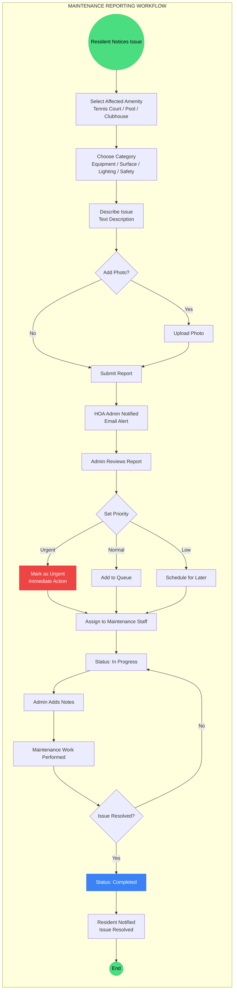
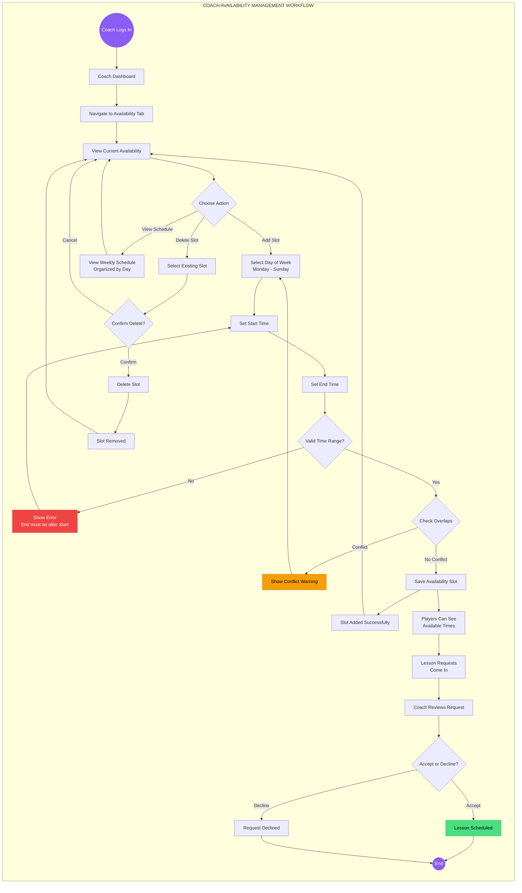

# Tennis Facility System - Workflow Flowcharts

## 1. Maintenance Reporting Workflow

---

## 2. Coach Availability Management Workflow

---

## 3. Player Pairing Algorithm Workflow

```mermaid
flowchart TD
    subgraph PAIRING["PLAYER PAIRING ALGORITHM WORKFLOW"]
        direction TB
        
        %% Entry
        PLAYER_START((Player Seeks Match)) --> SET_PREFS[Set Match Preferences]
        
        %% Preference Setup
        SET_PREFS --> TOGGLE[Toggle Looking to Play: ON]
        TOGGLE --> MATCH_TYPE[Select Match Types<br/>Singles / Doubles / Either]
        MATCH_TYPE --> DAYS[Select Preferred Days<br/>Weekdays / Weekends]
        DAYS --> TIMES[Select Preferred Times<br/>Morning / Afternoon / Evening]
        TIMES --> ADD_NOTES[Add Notes<br/>Optional Message]
        ADD_NOTES --> SAVE_PREFS[Save Preferences]
        
        %% Algorithm Matching
        SAVE_PREFS --> ENTER_POOL[Enter Matching Pool]
        ENTER_POOL --> ALGO{Matching Algorithm}
        
        %% Filtering Steps
        ALGO --> FILTER_HOA[Filter: Same HOA Community]
        FILTER_HOA --> FILTER_ACTIVE[Filter: Looking to Play = ON]
        FILTER_ACTIVE --> FILTER_TYPE[Match: Compatible Match Types<br/>Singles with Singles<br/>Doubles with Doubles]
        FILTER_TYPE --> FILTER_DAYS[Match: Overlapping Days]
        FILTER_DAYS --> FILTER_TIMES[Match: Overlapping Time Slots]
        
        %% Skill Matching
        FILTER_TIMES --> SKILL_CHECK{Skill Level Check}
        SKILL_CHECK --> UTR[Compare UTR Ratings<br/>Within 1.0 range]
        SKILL_CHECK --> NTRP[Compare NTRP Level<br/>Within 0.5 range]
        SKILL_CHECK --> WTN[Compare WTN Rating<br/>Within 2.0 range]
        UTR --> RANK_MATCHES
        NTRP --> RANK_MATCHES
        WTN --> RANK_MATCHES
        
        %% Results
        RANK_MATCHES[Rank Potential Matches<br/>Best Compatibility First] --> RESULTS{Matches Found?}
        RESULTS -->|No Matches| NO_MATCH[Show No Matches<br/>Suggest Expanding Criteria]
        RESULTS -->|Matches Found| DISPLAY[Display Match List<br/>With Compatibility Score]
        
        %% Player Actions
        DISPLAY --> PLAYER_ACTION{Player Action}
        PLAYER_ACTION -->|View Profile| VIEW_PROFILE[View Partner Profile<br/>Skill / Availability / Notes]
        PLAYER_ACTION -->|Send Request| SEND_REQ[Send Match Request]
        VIEW_PROFILE --> PLAYER_ACTION
        
        %% Request Flow
        SEND_REQ --> NOTIFY_PARTNER[Partner Receives Notification]
        NOTIFY_PARTNER --> PARTNER_RESPONSE{Partner Response}
        PARTNER_RESPONSE -->|Accept| MATCH_MADE[Match Confirmed<br/>Exchange Contact Info]
        PARTNER_RESPONSE -->|Decline| DECLINED[Request Declined<br/>Try Another]
        DECLINED --> DISPLAY
        MATCH_MADE --> SCHEDULE[Schedule Match Date and Court]
        SCHEDULE --> BOOK_COURT[Book Court Together]
        BOOK_COURT --> PLAY((Play Match))
        
        NO_MATCH --> ADJUST[Adjust Preferences]
        ADJUST --> TOGGLE
    end
    
    style PLAYER_START fill:#06b6d4,stroke:#0891b2,color:#fff
    style PLAY fill:#4ade80,stroke:#22c55e,color:#000
    style MATCH_MADE fill:#4ade80,stroke:#22c55e,color:#000
    style NO_MATCH fill:#f59e0b,stroke:#d97706,color:#000
    style ALGO fill:#8b5cf6,stroke:#7c3aed,color:#fff
```

---

## How to Use These Flowcharts

1. **Copy the Mermaid code** (everything between the triple backticks)
2. **Paste into [Mermaid Live Editor](https://mermaid.live)**
3. **Download as PNG or SVG** using the export buttons

### Alternative Tools
- [Mermaid Chart](https://www.mermaidchart.com/) - Create shareable links
- VS Code with Mermaid extension - Preview directly in editor
- GitHub/GitLab - Renders Mermaid automatically in markdown files
