# Tennis Facility Management System - Process Flowchart

## System Overview
This flowchart maps the complete user journey and system interactions for a tennis facility management platform within a residential HOA community.

## Stakeholders
- **Tennis Coaches**: Professionals offering lessons to players
- **HOA Resident Players**: Community members with court access
- **Non-HOA Residents**: Can book coach lessons but have NO court access
- **HOA Managers/Admins**: Facility administrators

---

## Complete System Flowchart

```mermaid
graph TD
    Start([User Visits Platform]) --> AuthCheck{Authenticated?}
    
    %% Authentication Flow
    AuthCheck -->|No| Login[Login/Register]
    Login --> RoleSelect{Select Role}
    RoleSelect -->|Coach| CoachReg[Coach Registration<br/>- Credentials<br/>- Sports offered<br/>- Hourly rate<br/>- Stripe Connect setup]
    RoleSelect -->|Player| PlayerReg[Player Registration<br/>- Skill level<br/>- Preferences]
    
    PlayerReg --> HOACheck{HOA Resident?}
    HOACheck -->|Yes| HOAVerify[HOA Verification<br/>Request to join community]
    HOACheck -->|No| GuestAccess[Guest Access<br/>Lesson booking only]
    
    HOAVerify --> PendingApproval[Pending HOA Admin Approval]
    PendingApproval --> HOAApproved{Approved?}
    HOAApproved -->|Yes| ResidentDash[Resident Dashboard]
    HOAApproved -->|No| GuestAccess
    
    CoachReg --> CoachDash[Coach Dashboard]
    GuestAccess --> GuestDash[Guest Dashboard<br/>Coach lessons only]
    
    AuthCheck -->|Yes| RoleCheck{User Role?}
    RoleCheck -->|Coach| CoachDash
    RoleCheck -->|HOA Resident| ResidentDash
    RoleCheck -->|Non-Resident| GuestDash
    RoleCheck -->|HOA Admin| AdminDash[HOA Admin Dashboard]
    
    %% HOA Resident Flow
    ResidentDash --> ResidentActions{Select Action}
    ResidentActions --> BookCourt[Book Court]
    ResidentActions --> FindCoach[Find Coach for Lesson]
    ResidentActions --> FindPartner[Find Playing Partner]
    ResidentActions --> JoinLadder[Join Ladder/League]
    ResidentActions --> ReportMaintenance[Report Maintenance Issue]
    
    %% Court Booking Flow (HOA Residents ONLY)
    BookCourt --> ViewAvailability[View Court Availability<br/>Check amenity rules]
    ViewAvailability --> SelectSlot[Select Date/Time/Court]
    SelectSlot --> RuleCheck{Meets Rules?<br/>- Advance booking days<br/>- Max duration<br/>- Peak hours<br/>- Booking limits}
    RuleCheck -->|No| ShowError[Show Error Message<br/>Display rule violation]
    ShowError --> ViewAvailability
    RuleCheck -->|Yes| AdminApprovalCheck{Requires Admin<br/>Approval?}
    AdminApprovalCheck -->|Yes| SubmitForApproval[Submit Booking Request]
    SubmitForApproval --> AdminReview[HOA Admin Reviews]
    AdminReview --> AdminDecision{Approved?}
    AdminDecision -->|No| NotifyRejection[Notify User - Rejected]
    AdminDecision -->|Yes| ConfirmBooking[Confirm Court Booking]
    AdminApprovalCheck -->|No| ConfirmBooking
    ConfirmBooking --> SendCourtNotif[Send Booking Confirmation<br/>Email/SMS notification]
    SendCourtNotif --> CourtBooked[Court Booking Complete]
    
    %% Coach Lesson Flow (All Users)
    FindCoach --> BrowseCoaches[Browse Available Coaches<br/>View profiles, ratings, rates]
    GuestDash --> BrowseCoaches
    BrowseCoaches --> SelectCoach[Select Coach]
    SelectCoach --> ViewCoachAvail[View Coach Availability]
    ViewCoachAvail --> RequestLesson[Request Lesson<br/>- Date/Time<br/>- Type<br/>- Skill level<br/>- Location]
    RequestLesson --> CoachReceivesReq[Coach Receives Request]
    CoachReceivesReq --> CoachDecision{Coach Accepts?}
    CoachDecision -->|No| NotifyPlayerDecline[Notify Player - Declined]
    CoachDecision -->|Yes| PaymentRequired[Payment Required]
    PaymentRequired --> StripeCheckout[Stripe Checkout<br/>Connect to Coach account]
    StripeCheckout --> PaymentSuccess{Payment<br/>Successful?}
    PaymentSuccess -->|No| PaymentFailed[Payment Failed<br/>Lesson not confirmed]
    PaymentSuccess -->|Yes| LessonConfirmed[Lesson Confirmed]
    LessonConfirmed --> SendLessonNotif[Send Notifications<br/>Both coach & player]
    SendLessonNotif --> LessonScheduled[Lesson Added to Schedule]
    
    %% Find Partner Flow (HOA Residents)
    FindPartner --> SetPreferences[Set Match Preferences<br/>- Looking to play toggle<br/>- Match types<br/>- Preferred days/times]
    SetPreferences --> BrowsePlayers[Browse Players<br/>Looking to play]
    BrowsePlayers --> SendMatchRequest[Send Match Request<br/>- Proposed date/time<br/>- Match type]
    SendMatchRequest --> OpponentResponse{Opponent<br/>Accepts?}
    OpponentResponse -->|No| MatchDeclined[Match Request Declined]
    OpponentResponse -->|Yes| MatchAccepted[Match Accepted]
    MatchAccepted --> SendMatchNotif[Send Match Notifications]
    SendMatchNotif --> MatchScheduled[Match Added to Calendar]
    
    %% Ladder/League Flow (HOA Residents)
    JoinLadder --> ViewLadders[View Available Ladders<br/>- Format: Singles/Doubles<br/>- NTRP requirements<br/>- Status]
    ViewLadders --> SelectLadder{Ladder Type}
    SelectLadder -->|Private| InviteRequired[Requires Invitation]
    SelectLadder -->|Public| JoinPublic[Join Ladder<br/>Create/join team]
    JoinPublic --> LadderActive{Ladder Active?}
    LadderActive -->|Setup| WaitForStart[Wait for Ladder Start]
    LadderActive -->|Active| PlayMatches[Play Scheduled Matches]
    PlayMatches --> SubmitScore[Submit Match Score<br/>- Sets won<br/>- Games won<br/>- Super tiebreak?]
    SubmitScore --> OpponentVerify{Opponent<br/>Confirms?}
    OpponentVerify -->|Dispute| DisputeResolution[Admin Reviews Dispute]
    OpponentVerify -->|Confirmed| UpdateStandings[Update Leaderboard<br/>Calculate points]
    UpdateStandings --> LadderContinue{More Rounds?}
    LadderContinue -->|Yes| PlayMatches
    LadderContinue -->|No| LadderComplete[Ladder Complete<br/>Final Standings]
    
    %% Maintenance Reporting (HOA Residents)
    ReportMaintenance --> FillReport[Fill Maintenance Report<br/>- Amenity<br/>- Category<br/>- Description<br/>- Photo upload]
    FillReport --> SubmitReport[Submit Report]
    SubmitReport --> AdminReceives[HOA Admin Receives Report]
    AdminReceives --> AdminAssigns[Admin Assigns & Tracks]
    AdminAssigns --> ReportResolved[Issue Resolved]
    
    %% Coach Dashboard Actions
    CoachDash --> CoachActions{Select Action}
    CoachActions --> ManageAvailability[Manage Availability<br/>Set weekly schedule]
    CoachActions --> ViewLessonReqs[View Lesson Requests]
    CoachActions --> ViewClients[View Clients & Notes]
    CoachActions --> ViewPayments[View Payments<br/>Stripe dashboard]
    CoachActions --> ViewReviews[View Reviews]
    
    ViewLessonReqs --> CoachReceivesReq
    
    %% Post-Lesson Review Flow
    LessonScheduled --> LessonDate{Lesson Date<br/>Arrives}
    MatchScheduled --> MatchDate{Match Date<br/>Arrives}
    LessonDate --> LessonComplete[Lesson Completed]
    LessonComplete --> ReviewPrompt[Player Prompted for Review]
    ReviewPrompt --> SubmitReview[Submit Review & Rating<br/>1-5 stars + text]
    SubmitReview --> CoachSeeReview[Coach Sees Review<br/>Can respond]
    CoachSeeReview --> ReviewPublic[Review Visible to Public]
    
    %% HOA Admin Dashboard
    AdminDash --> AdminActions{Select Action}
    AdminActions --> ManageCourts[Manage Courts/Amenities]
    AdminActions --> SetRules[Set Amenity Rules<br/>- Booking limits<br/>- Peak hours<br/>- Guest policies<br/>- Custom rules]
    AdminActions --> ReviewJoinReqs[Review Join Requests]
    AdminActions --> ApproveCourts[Approve Court Bookings]
    AdminActions --> ManageLadders[Manage Ladders<br/>Create & monitor]
    AdminActions --> ViewMaintenance[View Maintenance Reports]
    AdminActions --> ResolveDisputes[Resolve Match Disputes]
    
    ReviewJoinReqs --> HOAApproved
    ApproveCourts --> AdminDecision
    ResolveDisputes --> DisputeResolution
    DisputeResolution --> AdminFinalDecision[Admin Final Decision]
    
    %% End States
    CourtBooked --> End([User Continues Using App])
    PaymentFailed --> End
    NotifyPlayerDecline --> End
    MatchDeclined --> End
    NotifyRejection --> End
    ReviewPublic --> End
    LadderComplete --> End
    ReportResolved --> End
    AdminFinalDecision --> End
    
    style Start fill:#e1f5e1
    style End fill:#ffe1e1
    style CoachDash fill:#e3f2fd
    style ResidentDash fill:#f3e5f5
    style GuestDash fill:#fff3e0
    style AdminDash fill:#ffebee
    style ConfirmBooking fill:#c8e6c9
    style LessonConfirmed fill:#c8e6c9
    style PaymentSuccess fill:#c8e6c9
    style ShowError fill:#ffcdd2
    style PaymentFailed fill:#ffcdd2
```

---

## Key System Modules (Currently Implemented)

### 1. Authentication & User Management
- Multi-role support (Coach, Player, HOA Admin)
- HOA resident verification with admin approval
- Guest access (lesson booking only, no court access)
- Profile management with skill levels and preferences

### 2. Court/Amenity Booking System (HOA Residents ONLY)
- Real-time availability checking
- Amenity-specific rule enforcement
- Admin approval workflow for restricted bookings
- Automated notifications for confirmations and reminders
- **Non-residents have NO court access**

### 3. Coach Marketplace
- Coach profile creation with credentials and rates
- Availability management system
- Lesson request and approval workflow
- Stripe Connect integration for payments
- Available to both HOA residents and non-residents

### 4. Player Matching System (HOA Residents)
- Match preference settings
- Browse players looking to play
- Match request and acceptance workflow
- Calendar integration

### 5. Ladders & Leagues (HOA Residents)
- Create singles/doubles ladders
- NTRP-based eligibility
- Round-robin match generation
- Score submission with dispute resolution
- Real-time leaderboard updates
- Playoff bracket generation

### 6. Review & Rating System
- Post-lesson review prompts
- 1-5 star ratings with text reviews
- Coach response capability
- Public review visibility

### 7. Maintenance Reporting (HOA Residents)
- Category-based issue reporting
- Photo upload capability
- Admin assignment and tracking
- Status updates

### 8. HOA Admin Portal
- Court/amenity management
- Rule configuration per amenity
- Join request approvals
- Booking approvals (if required)
- Ladder administration
- Maintenance oversight
- Dispute resolution

### 9. Notification System
- Email notifications via Supabase Edge Functions
- Booking confirmations
- Lesson confirmations and reminders
- Match request updates
- Admin approval notifications

### 10. Payment Processing
- Stripe integration for coach lessons
- Connect accounts for coach payouts
- Transaction tracking and history
- Payment verification webhooks

---

## Special Access Rules

### HOA Residents
✅ Court booking access  
✅ Coach lesson booking  
✅ Player matching  
✅ Ladder/league participation  
✅ Maintenance reporting  
✅ Full facility access (subject to amenity rules)

### Non-HOA Residents (Guests)
❌ NO court booking access  
✅ Coach lesson booking only  
❌ NO player matching  
❌ NO ladder participation  
❌ NO maintenance reporting  

### Coaches
✅ Availability management  
✅ Accept/decline lesson requests  
✅ Client management  
✅ Payment dashboard  
⚠️ Cannot override HOA court rules  
⚠️ Subject to facility policies

### HOA Admins
✅ Full system access  
✅ Override booking schedules  
✅ Approve/reject join requests  
✅ Configure amenity rules  
✅ Resolve disputes  
✅ Manage all facility operations

---

## Usage Notes

- You can view this diagram using any Mermaid-compatible viewer
- Online viewers: [Mermaid Live Editor](https://mermaid.live), [Mermaid Chart](https://www.mermaidchart.com/)
- VS Code extension: "Markdown Preview Mermaid Support"
- This diagram reflects the CURRENT implementation of the platform
- Features not yet implemented are excluded
